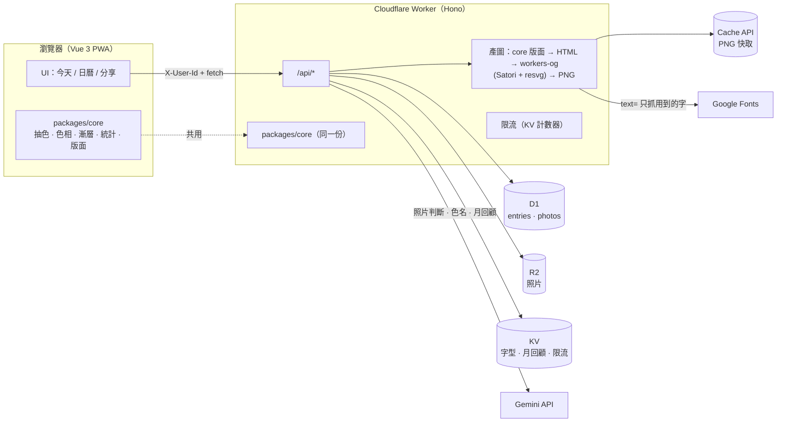

# 拾色 Hueday

> 每天拾起一個顏色，無壓力地記錄生活，再一鍵做成漂亮的限時動態。

**Color Hunt × Retro × Strava** 的生活記錄 PWA：在生活裡找「屬於某個顏色」的東西拍下來，用當天的顏色混成漸層底圖，照片當主角，產出可分享的 9:16 限動。

## 三種模式

| 模式 | 做什麼 |
| --- | --- |
| **Color Hunt** | 每天一個全民同色的題目（**單色日**），或不限顏色收集各種顏色（**集色日**）。AI 判斷照片是不是這個顏色，並為每張照片取一個詩意的色名（例：「傍晚捷運站的橘」）。 |
| **Retro** | 沒有瀏覽數、按讚數、追蹤者——純粹記錄。日曆牆、**去年的今天**、**月總結**（Spotify Wrapped 口吻）。 |
| **Strava** | 把顏色數據做成分享卡：連續記錄天數、收集色數、色相分佈、本月主色。 |

限動模板共 6 種，全部由 Worker 產生 1080×1920 PNG：

`Color Hunt 拼貼` · `Strava 風數據卡` · `單色日色票` · `去年 vs 今年` · `月總結` · `月色票海報`

## 截圖

| | 今天 | 日曆 | 分享 |
| --- | --- | --- | --- |
| iPhone 14 |  |  |  |
| Pixel 7 |  |  |  |

（由 `npm run screenshots` 產生，使用 `npm run seed` 的假資料。）

## 架構



三個設計原則（讓未來包成原生 App 時不用重寫）：

1. **核心邏輯是純 TypeScript**（`packages/core`，不碰 DOM/Vue/Worker API）：前端與 Worker 共用同一份抽色、色相分類、漸層、統計、版面座標。
2. **模板渲染在後端**：`GET /api/render?template=…` 直接回 PNG，前端只負責顯示與分享，不用 html2canvas。
3. **前端只負責 UI 與呼叫 API**：換 Capacitor 或 Expo 只需動 UI 層。

```
apps/web        Vue 3 + Vite + TS 前端（PWA）
apps/api        Cloudflare Worker（Hono）＋ D1 / R2 / KV
packages/core   純 TypeScript 邏輯（色票、抽色、漸層、統計、模板版面…）
docs/           截圖
scripts/        圖示、截圖、共用腳本
```

### 主要 API

所有 `/api/*`（除了 `health`）都需要 `X-User-Id`（前端產生的匿名 UUID）。錯誤一律是 `{ "error": { "code", "message" } }`。

| 端點 | 說明 |
| --- | --- |
| `GET /api/health` | 健康檢查 |
| `GET /api/entries/:date` · `GET /api/entries?month=` | 當天記錄與照片 · 月曆摘要 |
| `POST /api/entries/:date/photos` | 上傳照片（multipart，≤ 10 MB，JPEG/PNG/WebP/HEIC） |
| `PUT /api/entries/:date/note` | 儲存備註 |
| `GET /api/photos/:id` | 串流照片 |
| `GET /api/stats?month=` | 連續天數、收集色數、色相佔比、本月主色 |
| `POST /api/recap?month=` | 月總結文字（同月只產一次，`force=1` 重產） |
| `GET /api/render?template=&date=\|month=&style=&grain=` | 產出限動 PNG |

## 使用的第三方服務

| 服務 | 用途 |
| --- | --- |
| **Gemini API** | Vision 判斷照片主體是否屬於目標顏色、詩意色名、月總結文案（`responseSchema` 結構化輸出） |
| **Cloudflare Workers / D1 / R2 / KV / Cache API** | API、資料庫、照片儲存、字型／月回顧／限流、PNG 快取 |
| **workers-og（Satori + resvg）** | 在 Worker 上把 HTML 版面轉成 PNG |
| **Google Fonts（CSS2 `text=`）** | 中文字型只下載用到的字（Noto Sans TC + Fraunces），快取在 KV |
| Vue 3、Vite、vite-plugin-pwa、Hono | 前端、建置、PWA、Worker 框架 |

**沒有設定 `GEMINI_API_KEY` 時整個 App 仍可完整操作**：Gemini 相關功能會回傳示意資料（回應帶 `mock: true`，畫面標示「示意」）。

## 本地開發

需求：Node.js 20+（開發時使用 22）。

```bash
npm install
npm run build          # 依序 build core → api（wrangler 打包驗證）→ web
npm test               # 所有 workspace 的 vitest
```

```bash
npm run migrate:local  # 建立本地 D1 資料表（第一次、或 migrations 有更新時）
npm run dev            # 同時啟動 Vite（http://localhost:5173）與 wrangler dev（8787）
```

`/api` 會由 Vite 代理到 8787。開 <http://localhost:5173> 即可使用。

### 想接真的 Gemini

在 `apps/api/.dev.vars`（已被 `.gitignore`，**不要 commit**）寫入：

```
GEMINI_API_KEY=你的金鑰
```

模型名稱在 `apps/api/wrangler.toml` 的 `GEMINI_MODEL`。

### 開發輔助

```bash
npm run seed           # 在本地 D1/R2 塞過去 400 天的假資料（使用者 seed-user）
```

- 開 <http://localhost:5173/?uid=seed-user> 用假資料瀏覽（`?uid=` 只在 dev 模式生效），可看到日曆牆、去年的今天、月總結。
- `SEED_USER=xxx SEED_TODAY=2026-09-29 npm run seed` 可指定使用者與「今天」。
- **模擬錯誤**（dev 才生效）：網址加 `?simulate=xxx`（`?simulate=off` 清除），或在 console 執行 `__simulate('xxx')`：
  `offline` · `crash` · `upload-fail` · `gemini-quota` · `gemini-timeout` · `gemini-error` · `render-fail` · `rate-limit` · `server-error`
- 更新 App 圖示：`node scripts/gen-icons.mjs`

### 截圖與手機版檢查

```bash
npm run dev            # 另一個終端機先啟動；想要有內容先 npm run seed
npm run screenshots    # iPhone 14 與 Pixel 7 各截三個 tab 存到 docs/screenshots/
```

腳本會同時檢查：無水平捲動、文字 ≥ 15px、觸控目標 ≥ 44px，有問題會以非 0 結束。

### 測試

```bash
npm test -w packages/core   # 抽色、色相、漸層、統計、模板版面…
npm test -w apps/api        # 路由、限流、快取、Gemini（mock fetch）、模板 HTML；D1/R2/KV 用 wrangler 內建 miniflare
npm test -w apps/web        # 分享、錯誤訊息、模板設定
```

## 部署

需要 Cloudflare 帳號，步驟見 **[apps/api/DEPLOY.md](apps/api/DEPLOY.md)**（建立 D1/R2/KV、套用 migration、設定 secret、部署 Worker 與 Pages）。

幾件部署前一定要知道的事（細節在 DEPLOY.md）：

- 產圖很吃 CPU，**需要 Workers Paid 方案**（免費方案 CPU 上限 10 ms）。
- PNG 快取使用 Cache API，**在 `*.workers.dev` 不生效，需要自訂網域**。
- 限流是 KV 近似計數器（KV 非原子），要嚴格限流請改用 Durable Object。

## 專案文件

- [`PROJECT_BRIEF.md`](PROJECT_BRIEF.md) — 產品構想與原始 22 步 prompt 路線
- [`PROMPTS.md`](PROMPTS.md) — 逐步任務與完成條件（全部完成）
- [`NOTES.md`](NOTES.md) — 每一步的決定、踩到的坑，以及最後的**使用者待辦**清單
- [`CLAUDE.md`](CLAUDE.md) — 專案規則

## 階段二：原生 App

沿用 `packages/core` 與 Worker API：路線 A 用 Capacitor 包 Vue（補原生 IG 限動分享、推播、EXIF）；路線 B 用 Expo 重寫 UI。網頁版刻意跳過的項目：IG Share to Stories、每日提醒推播、照片 EXIF、桌面小工具、會動的 MP4 限動。
