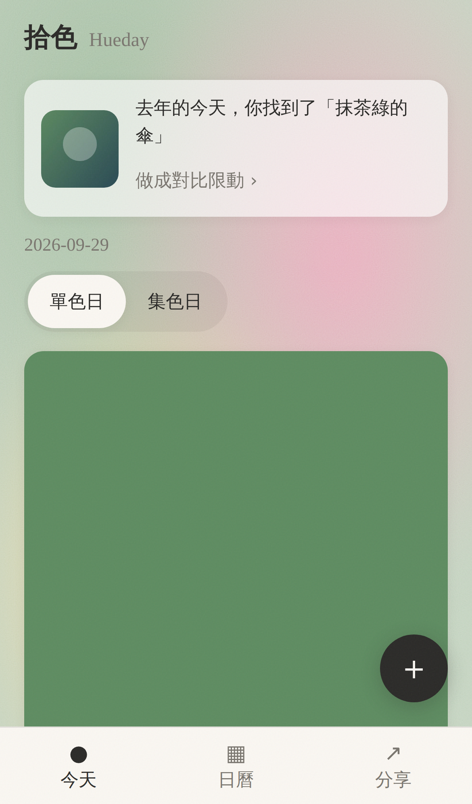
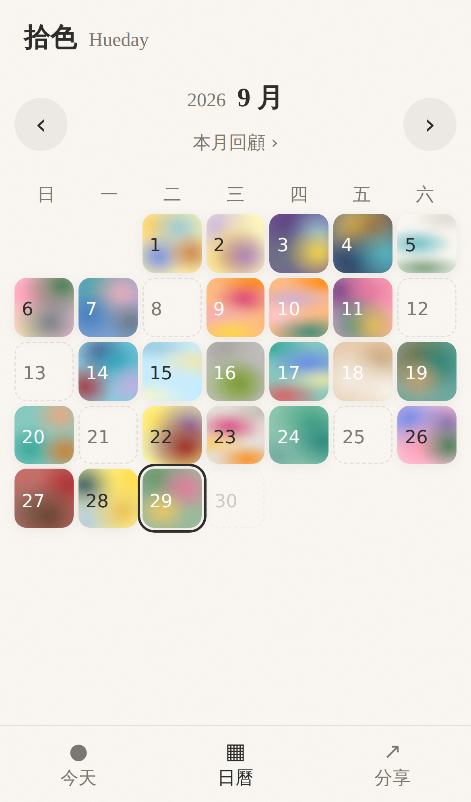
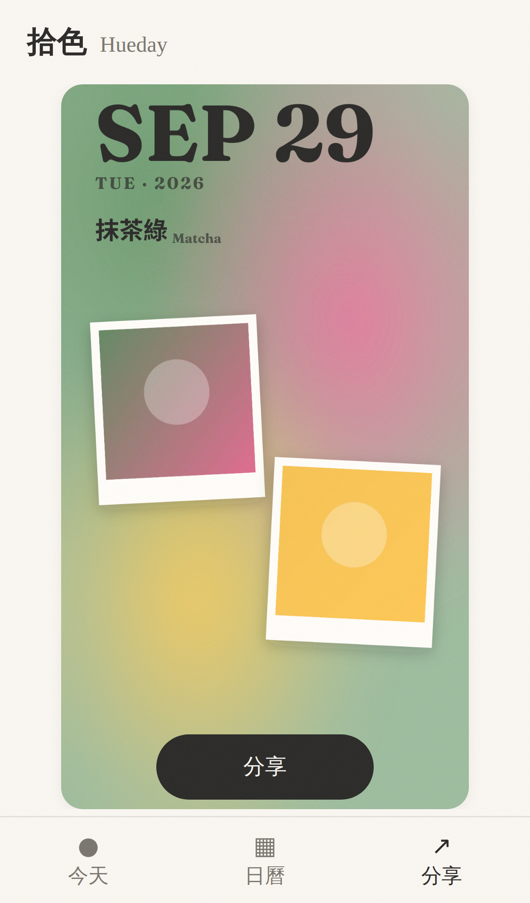
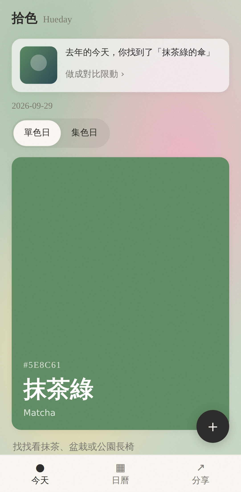
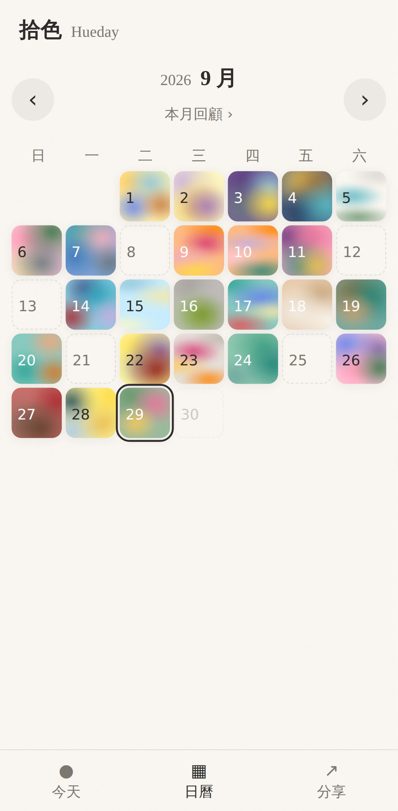
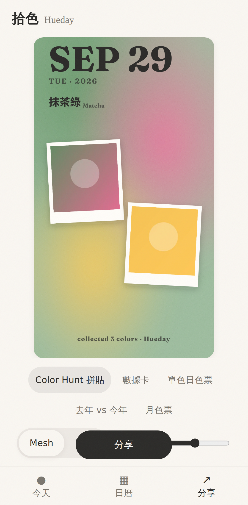
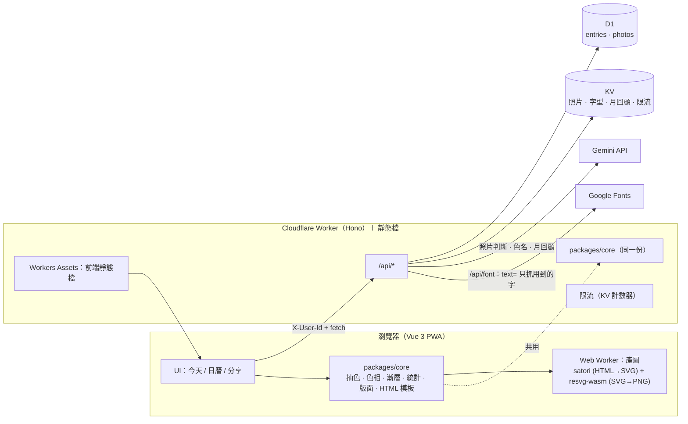

# 拾色 Hueday

> 每天拾起一個顏色，無壓力地記錄生活，再一鍵做成漂亮的限時動態。

**Color Hunt × Retro × Strava** 的生活記錄 PWA：在生活裡找「屬於某個顏色」的東西拍下來，用當天的顏色混成漸層底圖，照片當主角，產出可分享的 9:16 限動。

## 三種模式

| 模式 | 做什麼 |
| --- | --- |
| **Color Hunt** | 每天一個全民同色的題目（**單色日**），或不限顏色收集各種顏色（**集色日**）。AI 判斷照片是不是這個顏色，並為每張照片取一個詩意的色名（例：「傍晚捷運站的橘」）。 |
| **Retro** | 沒有瀏覽數、按讚數、追蹤者——純粹記錄。日曆牆、**去年的今天**、**月總結**（Spotify Wrapped 口吻）。 |
| **Strava** | 把顏色數據做成分享卡：連續記錄天數、收集色數、色相分佈、本月主色。 |

限動模板共 6 種，全部在你的手機／瀏覽器裡產生 1080×1920 PNG（不需要伺服器端產圖）：

`Color Hunt 拼貼` · `Strava 風數據卡` · `單色日色票` · `去年 vs 今年` · `月總結` · `月色票海報`

## 截圖

| | 今天 | 日曆 | 分享 |
| --- | --- | --- | --- |
| iPhone 14 |  |  |  |
| Pixel 7 |  |  |  |

（由 `npm run screenshots` 產生，使用 `npm run seed` 的假資料。）

## 架構



三個設計原則（讓未來包成原生 App 時不用重寫）：

1. **核心邏輯是純 TypeScript**（`packages/core`，不碰 DOM/Vue/Worker API）：前端與 Worker 共用同一份抽色、色相分類、漸層、統計、版面座標。
2. **模板只寫一次**：版面座標與 HTML 模板都在 `packages/core`；在瀏覽器的 Web Worker 用 satori + resvg-wasm 轉成 PNG（不用 html2canvas，也不占用 Worker 的 CPU，所以 Cloudflare 免費方案就夠用）。
3. **前端只負責 UI 與呼叫 API**：換 Capacitor 或 Expo 只需動 UI 層。

```
apps/web        Vue 3 + Vite + TS 前端（PWA）；src/render/ 是瀏覽器端產圖（Web Worker）
apps/api        Cloudflare Worker（Hono）＋ D1 / KV
packages/core   純 TypeScript 邏輯（色票、抽色、漸層、統計、模板版面…）
docs/           截圖
scripts/        圖示、截圖、共用腳本
```

### 主要 API

所有 `/api/*`（除了 `health`）都需要 `X-User-Id`（前端產生的匿名 UUID）。錯誤一律是 `{ "error": { "code", "message" } }`。

| 端點 | 說明 |
| --- | --- |
| `GET /api/health` | 健康檢查 |
| `GET /api/entries/:date` · `GET /api/entries?month=` | 當天記錄與照片 · 月曆摘要 |
| `POST /api/entries/:date/photos` | 上傳照片（multipart，≤ 10 MB，JPEG/PNG/WebP/HEIC） |
| `PUT /api/entries/:date/note` | 儲存備註 |
| `GET /api/photos/:id` | 串流照片 |
| `GET /api/stats?month=` | 連續天數、收集色數、色相佔比、本月主色 |
| `POST /api/recap?month=` | 月總結文字（同月只產一次，`force=1` 重產） |
| `GET /api/font?family=&weight=&text=` | 字型代理：向 Google Fonts 取 TTF 子集（只含用到的字），快取在 KV |

## 使用的第三方服務

| 服務 | 用途 |
| --- | --- |
| **Gemini API** | Vision 判斷照片主體是否屬於目標顏色、詩意色名、月總結文案（`responseSchema` 結構化輸出） |
| **Cloudflare Workers（含 Assets）/ D1 / KV** | API 與前端靜態檔、資料庫、照片／字型／月回顧／限流 |
| **satori + resvg-wasm**（瀏覽器端） | 在 Web Worker 裡把 HTML 版面轉成 PNG |
| **Google Fonts（CSS2 `text=`）** | 中文字型只下載用到的字（Noto Sans TC + Fraunces），快取在 KV |
| Vue 3、Vite、vite-plugin-pwa、Hono | 前端、建置、PWA、Worker 框架 |

**沒有設定 `GEMINI_API_KEY` 時整個 App 仍可完整操作**：Gemini 相關功能會回傳示意資料（回應帶 `mock: true`，畫面標示「示意」）。

## 本地開發

需求：**Node.js 22 以上**（wrangler、miniflare 等套件要求；用 `node -v` 確認，舊版可用 nvm 或 Homebrew 升級）。

> 貼指令到 macOS 的 zsh 時，請不要帶 `#` 後面的註解（zsh 互動模式不把它當註解，會被當成參數）。下面的程式碼區塊都不含註解，說明放在區塊外。

```bash
npm install
npm run build
npm test
```

`build` 依序建置 core → 前端 → api（wrangler 打包驗證）；`test` 會跑所有 workspace 的 vitest。

```bash
npm run migrate:local
npm run dev
```

`/api` 會由 Vite 代理到 8787。開 <http://localhost:5173> 即可使用。

### 想接真的 Gemini

在 `apps/api/.dev.vars`（已被 `.gitignore`，**不要 commit**）寫入：

```
GEMINI_API_KEY=你的金鑰
```

模型名稱在 `apps/api/wrangler.toml` 的 `GEMINI_MODEL`。

### 開發輔助

```bash
npm run seed
```

- 開 <http://localhost:5173/?uid=seed-user> 用假資料瀏覽（`?uid=` 只在 dev 模式生效），可看到日曆牆、去年的今天、月總結。
- `SEED_USER=xxx SEED_TODAY=2026-09-29 npm run seed` 可指定使用者與「今天」。
- **模擬錯誤**（dev 才生效）：網址加 `?simulate=xxx`（`?simulate=off` 清除），或在 console 執行 `__simulate('xxx')`：
  `offline` · `crash` · `upload-fail` · `gemini-quota` · `gemini-timeout` · `gemini-error` · `render-fail` · `rate-limit` · `server-error`
- 更新 App 圖示：`node scripts/gen-icons.mjs`

### 截圖與手機版檢查

```bash
npm run dev
npm run screenshots
```

腳本會同時檢查：無水平捲動、文字 ≥ 15px、觸控目標 ≥ 44px，有問題會以非 0 結束。

### 測試

```bash
npm test -w packages/core
npm test -w apps/api
npm test -w apps/web
```

## 部署

**Cloudflare 免費方案就夠，不需要付費、不需要自訂網域。** 整個 App 是一個 Worker：同時提供 `/api/*` 與前端靜態檔（Workers Assets），所以只有一個網址。限動圖在使用者的手機裡產生，不占用 Worker 的 CPU。

```bash
npm run deploy
```

完整步驟、免費額度與注意事項見 **[apps/api/DEPLOY.md](apps/api/DEPLOY.md)**。幾件要知道的事：

- **不需要綁信用卡**：照片存在 KV（不用 R2——R2 需要綁付款方式才能啟用）。代價是 KV 免費額度：1 GB 儲存、每天 1,000 次寫入（上傳一張照片約 2–4 次），個人使用足夠。
- **目前沒有登入**，知道網址的人都能使用；自己用建議不要公開網址，或用 Cloudflare Access 保護。

## 專案文件

- [`PROJECT_BRIEF.md`](PROJECT_BRIEF.md) — 產品構想與原始 22 步 prompt 路線
- [`PROMPTS.md`](PROMPTS.md) — 逐步任務與完成條件（全部完成）
- [`NOTES.md`](NOTES.md) — 每一步的決定、踩到的坑，以及最後的**使用者待辦**清單
- [`CLAUDE.md`](CLAUDE.md) — 專案規則

## 階段二：原生 App

沿用 `packages/core` 與 Worker API：路線 A 用 Capacitor 包 Vue（補原生 IG 限動分享、推播、EXIF）；路線 B 用 Expo 重寫 UI。網頁版刻意跳過的項目：IG Share to Stories、每日提醒推播、照片 EXIF、桌面小工具、會動的 MP4 限動。
